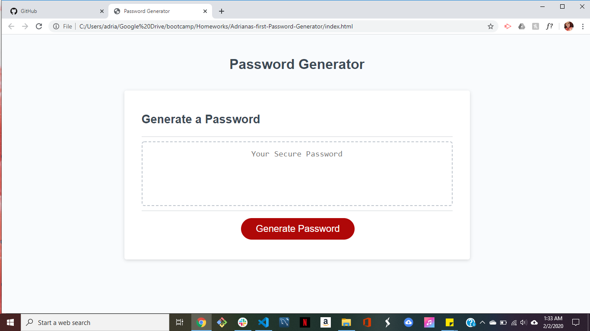

# Password-Generator
write javascript code in order to allow the user to generate a password, on click of the button, to their specifications:uppercase, lowercase, numbers, special characters and the length. 
using loops, arrays, prompts, functions, DOM, dot notation, variables and alerts. 

[link to deployed](https://adriana-didden.github.io/Random-Password-Generator/)

